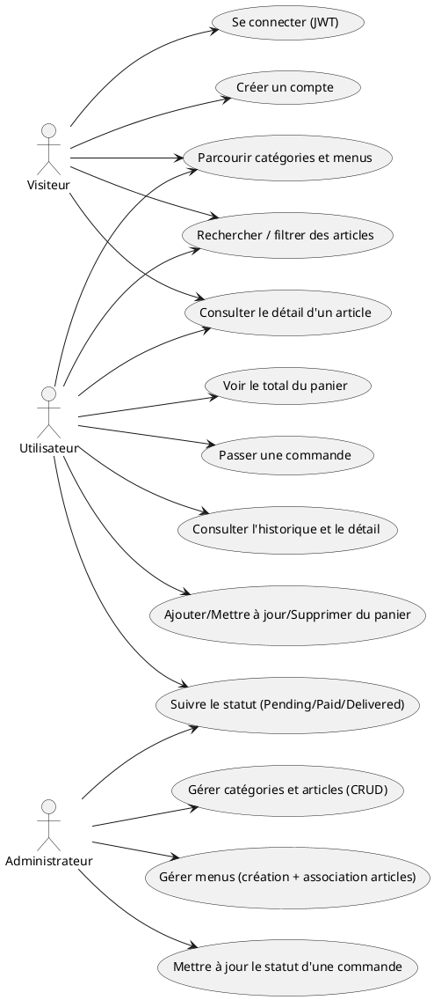
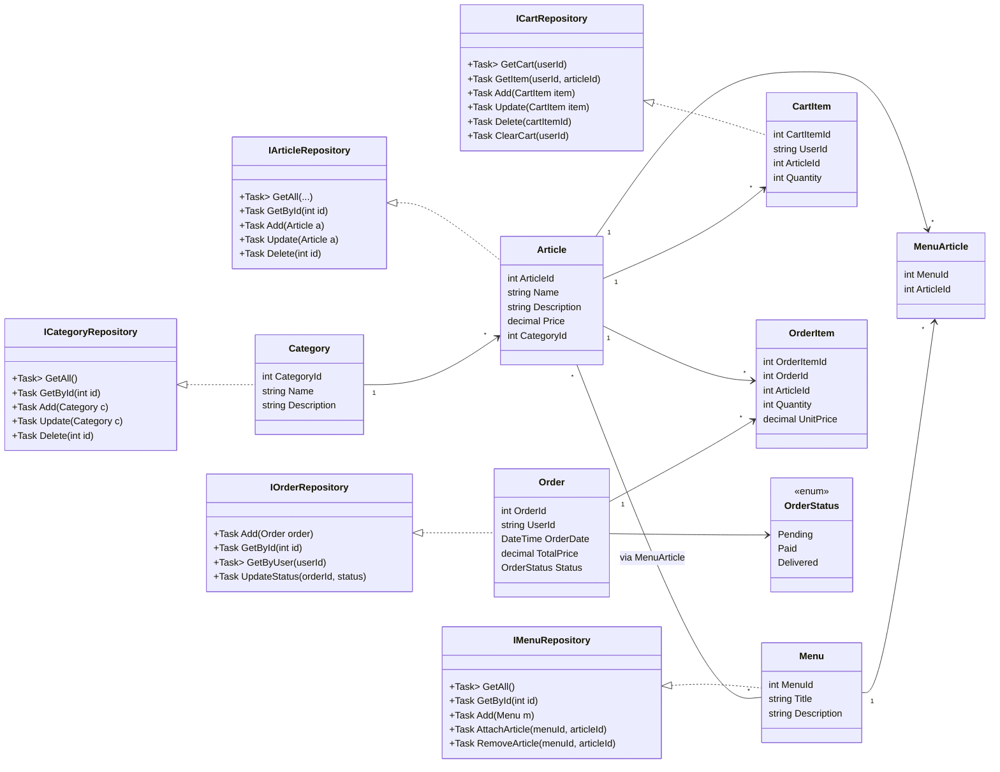
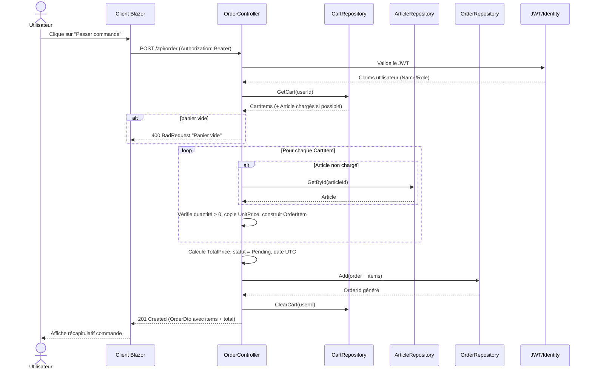

# MonResto – API REST + EF Core + Repository + JWT + Blazor

MonResto est une solution .NET complète qui propose une API REST sécurisée et un client Blazor WebAssembly pour gérer un catalogue de restauration (catégories, articles, menus), un panier et des commandes. L’architecture suit les bonnes pratiques Clean Architecture avec séparation des responsabilités, mapping DTO/entités, et authentification JWT via ASP.NET Core Identity.

## 📁 Architecture de la solution
```
MonResto.sln
├─ MonResto.Domain      // Entités métier, DTOs, interfaces de repository, enums
├─ MonResto.Data        // DbContext EF Core, configurations, repositories implémentés
├─ MonResto.WebAPI      // API REST ASP.NET Core, JWT, controllers, AutoMapper, Swagger
└─ MonResto.BlazorClient// Client Blazor WASM, services HttpClient, pages et modèles
```

### Domain
- Entités : `Category`, `Article`, `Menu` (many-to-many Articles), `CartItem`, `Order`, `OrderItem`.
- Enum : `OrderStatus` (`Pending`, `Paid`, `Delivered`).
- DTOs pour exposer les données côté API/Blazor.
- Interfaces de repository pour chaque agrégat (CRUD async).

### Data
- `AppDbContext` hérite de `IdentityDbContext` pour inclure les tables Identity.
- Mapping Fluent API pour relations one-to-many et many-to-many (Menu–Article, Order–OrderItem).
- Repositories concrets utilisant EF Core et LINQ.

### WebAPI
- Configurations `appsettings.json` (connection strings, JWT) et `Program.cs` (DI, Auth, Swagger).
- Controllers : catégories, articles (recherche par nom, filtre par catégorie), menus (ajout/retrait d’article), panier, commandes (calcul du total + historique), compte (register/login avec JWT).
- AutoMapper profile pour convertir entités ⇔ DTOs.
- Swagger configuré avec schéma de sécurité bearer JWT.

### Blazor Client
- Services `HttpClient` pour categories, articles, panier, commandes, authentification (gestion token + `Authorization` header).
- Pages : accueil (catégories + menus), liste d’articles par catégorie, détail d’un article (ajout au panier), panier (édition/suppression), commande, historique, login/register.

## 🧱 Vue d’ensemble de l’architecture
- **Couche Domain** : modèle métier (entités + DTOs) et interfaces de repository. Aucun accès aux frameworks.
- **Couche Data** : implémentations EF Core, configuration du schéma relationnel (PostgreSQL) et semences de données.
- **Couche WebAPI** : exposition des use cases via des controllers REST, mapping AutoMapper, configuration JWT/Identity, Swagger.
- **Couche Blazor** : client WebAssembly qui consomme l’API via `HttpClient`, stocke le JWT et gère l’état d’authentification.
- **Communication** : HTTP/JSON uniquement. Le front appelle l’API via des services dédiés (`CategoryService`, `ArticleService`, `CartService`, `OrderService`, `AuthService`) et transmet le JWT dans l’en-tête `Authorization: Bearer <token>`.

## 🔄 Flux front ↔ back
1. **Authentification** :
   - Blazor appelle `POST /api/account/register` ou `POST /api/account/login` via `AuthService`. En cas de succès, le JWT est mémorisé par `AuthStateProvider` et injecté dans tous les appels suivants.
2. **Catalogue** :
   - `CategoryService` et `ArticleService` consomment `GET /api/categories`, `GET /api/articles`, `GET /api/articles?categoryId=...` pour construire les pages de navigation et de recherche.
3. **Panier** :
   - `CartService` envoie `POST /api/cart` pour ajouter, `PUT /api/cart/{id}` pour modifier, `DELETE /api/cart/{id}` pour retirer, et `GET /api/cart/summary` pour le total. Les appels sont protégés par JWT.
4. **Commande** :
   - `OrderService` poste `POST /api/order` en reprenant les lignes du panier, puis consulte l’historique via `GET /api/order` et le détail via `GET /api/order/{id}`. Le back calcule le total et crée les `OrderItem`.
5. **Administration** :
   - Les comptes ayant le rôle `Admin` utilisent `PATCH /api/order/{id}/status` pour mettre à jour le statut (par exemple `Paid` ou `Delivered`).

## 📜 Swagger et catalogue des web services
- Swagger est activé en développement et accessible sur `https://localhost:5001/swagger` (ou `http://localhost:5000/swagger`).
- Cliquez sur **Authorize** et collez `Bearer <token>` pour tester les routes protégées.
- Le document JSON est disponible sur `/swagger/v1/swagger.json` et peut être importé dans Postman/Bruno.

### Principaux endpoints
- **Authentification** (`AccountController`)
  - `POST /api/account/register` : crée un utilisateur Identity et retourne 200 OK ou les erreurs de validation.
  - `POST /api/account/login` : vérifie les identifiants et renvoie `{ userName, token, expires }`.
- **Catégories** (`CategoriesController`)
  - `GET /api/categories` : liste l’ensemble des catégories.
  - `POST /api/categories` (authentifié) : crée une catégorie.
  - `PUT /api/categories/{id}` / `DELETE /api/categories/{id}` : met à jour ou supprime.
- **Articles** (`ArticlesController`)
  - `GET /api/articles` : liste, filtrable par `categoryId` ou `name` (query string).
  - `GET /api/articles/{id}` : récupère un article.
  - `POST /api/articles`, `PUT /api/articles/{id}`, `DELETE /api/articles/{id}` : gestion du catalogue.
- **Menus** (`MenuController`)
  - `GET /api/menu` et `GET /api/menu/{id}` : consulter les menus et leurs articles.
  - `POST /api/menu` : créer un menu, `POST /api/menu/{menuId}/articles/{articleId}` : ajouter un article, `DELETE /api/menu/{menuId}/articles/{articleId}` : retirer.
- **Panier** (`CartController`, protégé JWT)
  - `GET /api/cart` : panier courant.
  - `GET /api/cart/summary` : quantités + total.
  - `POST /api/cart` : ajoute ou incrémente une ligne.
  - `PUT /api/cart/{cartItemId}` : modifie la quantité.
  - `DELETE /api/cart/{cartItemId}` : supprime la ligne.
- **Commandes** (`OrderController`, protégé JWT)
  - `GET /api/order` : historique de l’utilisateur connecté.
  - `GET /api/order/{id}` : détail d’une commande.
  - `POST /api/order` : transforme le panier en commande en calculant `TotalPrice`.
  - `PATCH /api/order/{id}/status` : réservé aux admins pour passer l’état à `Paid` ou `Delivered`.

## 🧪 Scénario de test de bout en bout
1. **Inscription** : appeler `POST /api/account/register` avec `{ "userName": "alice", "email": "alice@example.com", "password": "Passw0rd!" }` via Swagger.
2. **Connexion** : `POST /api/account/login` avec les identifiants. Copier le `token` et l’injecter dans Swagger via **Authorize**.
3. **Remplir le catalogue** (si vide) : créer une catégorie (`POST /api/categories`), puis des articles (`POST /api/articles`).
4. **Constituer le panier** :
   - `POST /api/cart` pour ajouter un article (ex. `{ "articleId": 1, "quantity": 2 }`).
   - `GET /api/cart/summary` pour vérifier totaux et quantités.
5. **Passer commande** : `POST /api/order` sans corps supplémentaire (le back récupère le panier de l’utilisateur).
6. **Suivre la commande** :
   - Utilisateur : `GET /api/order` pour l’historique, `GET /api/order/{id}` pour le détail.
   - Admin : `PATCH /api/order/{id}/status` avec `{ "status": "Paid" }` puis `{ "status": "Delivered" }`.
7. **Nettoyage** : `DELETE /api/cart/{cartItemId}` si besoin pour repartir de zéro.

## 👥 Rôles et autorisations
- **Utilisateur authentifié** : accès aux endpoints panier (`/api/cart`) et commandes (`/api/order`), création de contenu personnel (panier, commandes). Ne peut pas modifier le statut d’une commande autre que via son propre flux de création.
- **Administrateur (`Admin`)** : dispose des mêmes droits qu’un utilisateur, plus la capacité de mettre à jour le statut d’une commande via `PATCH /api/order/{id}/status`. Le rôle est créé au démarrage et assigné à l’utilisateur `admin@monresto.com`.
- Les rôles sont stockés via ASP.NET Core Identity et les claims sont inclus dans le JWT ; le middleware `UseAuthorization()` s’appuie sur ces rôles pour filtrer les endpoints protégés.

## 🗃️ Schéma relationnel (simplifié)
```
Users (Identity)
Roles (Identity)
└─ UserRoles (UserId ↔ RoleId)

Categories (CategoryId PK)
└─ Articles (ArticleId PK, FK CategoryId) --< CartItems (CartItemId PK, FK ArticleId, UserId)
                  └─< OrderItems (OrderItemId PK, FK ArticleId, OrderId)

Menus (MenuId PK)
└─ MenuArticles (PK {MenuId, ArticleId}, FK vers Menus et Articles)

Orders (OrderId PK, UserId, TotalPrice, Status)
└─ OrderItems (OrderId FK, ArticleId FK, Quantity, UnitPrice)
```
- Les relations clés sont configurées dans `AppDbContext` : many-to-many `Menu`–`Article` via `MenuArticle`, one-to-many `Category`→`Article`, `Order`→`OrderItem`, et les entités Identity pour les utilisateurs et rôles.

## 🎨 Diagrammes UML (PlantUML / Mermaid)
### Cas d'utilisation (PlantUML)


### Diagramme de classes (Mermaid)


### Diagramme de séquence (Mermaid)


## 📚 Glossaire (mots-clés techniques)
- **API REST** : interface HTTP qui expose des ressources (catégories, articles, panier, commandes) via des méthodes standard.
- **JWT (JSON Web Token)** : jeton signé inclus dans l’en-tête `Authorization` pour authentifier l’utilisateur sur les routes protégées.
- **Backend** : l’API ASP.NET Core (`MonResto.WebAPI`) qui traite les requêtes, applique les règles métier et dialogue avec la base PostgreSQL via EF Core.
- **Frontend** : le client Blazor WebAssembly (`MonResto.BlazorClient`) qui s’exécute dans le navigateur et appelle l’API.
- **Port** : l’API écoute par défaut sur 5000 (HTTP) / 5001 (HTTPS) en développement ; le client Blazor tourne sur 5002/5003 selon le profil de lancement.
- **Repository** : pattern de persistance implémenté dans `MonResto.Data.Repositories` pour isoler EF Core du reste de l’application.
- **DbContext** : `AppDbContext` gère le mapping entités ↔ tables et les transactions.
- **Swagger/OpenAPI** : documentation interactive générée pour tester les web services.
- **Identity** : module ASP.NET Core pour gérer utilisateurs, rôles, hachage des mots de passe et émission des claims présents dans le JWT.

## 🔎 Si vous voulez aller plus loin
- Ajouter des tests d’intégration autour des controllers (xUnit) en utilisant `WebApplicationFactory`.
- Étendre le modèle (options de livraison, photos d’articles) en ajoutant les entités dans `MonResto.Domain/Entities` et en mettant à jour `AppDbContext` + migrations.
- Mettre en place un pipeline CI/CD qui exécute `dotnet restore`, `dotnet build` et des tests automatisés avant chaque déploiement.

## 🧰 Prérequis
- .NET 7 SDK ou supérieur installé.
- PostgreSQL accessible (local ou conteneur). Créez une base de données (ex: `monresto`).
- `dotnet-ef` pour appliquer les migrations si vous souhaitez les exécuter en local.

## ⚙️ Configuration
Modifiez `MonResto.WebAPI/appsettings.json` (ou variables d’environnement) :
```json
{
  "ConnectionStrings": {
    "DefaultConnection": "Host=localhost;Port=5432;Database=monresto;Username=postgres;Password=postgres"
  },
  "Jwt": {
    "Issuer": "MonResto",
    "Audience": "MonRestoClient",
    "SecretKey": "votre_cle_super_secrete_au_moins_32_caracteres"
  },
  "Logging": {
    "LogLevel": {
      "Default": "Information",
      "Microsoft.AspNetCore": "Warning"
    }
  }
}
```

## 🚀 Mise en route
### 1) Restaurer et compiler
> ℹ️ Sous Windows, **ne définissez pas** `DOTNET_SYSTEM_GLOBALIZATION_INVARIANT` : les commandes échouent. Utilisez simplement `dotnet restore`/`dotnet build`.

```bash
cd MonResto.WebAPI

# Linux/macOS (si vous avez des soucis de locales)
DOTNET_SYSTEM_GLOBALIZATION_INVARIANT=1 dotnet restore
DOTNET_SYSTEM_GLOBALIZATION_INVARIANT=1 dotnet build

# Windows
dotnet restore
dotnet build
```

### Données de démo automatiques
- Un administrateur par défaut est créé avec l'email `admin@monresto.com` et le mot de passe `Passw0rd!` (rôle `Admin`).
- Des exemples de catégories, articles et un menu "Menu Gourmand" sont insérés lors du premier lancement.
Ces données sont générées automatiquement au démarrage de l'API si la base est vide.

### 2) Appliquer les migrations (PostgreSQL)
Installez l’outil local `dotnet-ef` défini dans le manifeste avant d’exécuter les commandes ci-dessous. 💡 **Le chemin du projet doit rester dans le repo courant** (ne mettez pas `../MonResto.Data`, qui pointe en dehors du dossier et provoque l’erreur « Le fichier projet n'existe pas »).
```bash
# Depuis la racine du repo
dotnet tool restore

# Linux/macOS
DOTNET_SYSTEM_GLOBALIZATION_INVARIANT=1 dotnet ef database update \
  --project MonResto.Data/MonResto.Data.csproj \
  --startup-project MonResto.WebAPI/MonResto.WebAPI.csproj

# Windows
dotnet ef database update \
  --project MonResto.Data/MonResto.Data.csproj \
  --startup-project MonResto.WebAPI/MonResto.WebAPI.csproj
```

### 3) Lancer l’API
```bash
# Linux/macOS
DOTNET_SYSTEM_GLOBALIZATION_INVARIANT=1 dotnet run

# Windows (depuis la racine du repo)
dotnet run --project MonResto.WebAPI/MonResto.WebAPI.csproj
```
- Swagger disponible sur `https://localhost:5001/swagger` (ou `http://localhost:5000`).
- Ajoutez un token JWT via le bouton **Authorize** pour tester les endpoints protégés.

### 4) Lancer le client Blazor WebAssembly
```bash
cd ../MonResto.BlazorClient
DOTNET_SYSTEM_GLOBALIZATION_INVARIANT=1 dotnet restore  # Linux/macOS
DOTNET_SYSTEM_GLOBALIZATION_INVARIANT=1 dotnet run      # Linux/macOS

dotnet restore  # Windows
dotnet run      # Windows
```
- L’application consomme l’API configurée dans `Program.cs`/`appsettings` du client. Adaptez l’URL si besoin.

## 🔐 Authentification & Autorisations
- Enregistrement (`/api/account/register`) et connexion (`/api/account/login`) retournent un JWT.
- Les routes panier/commandes exigent l’en-tête `Authorization: Bearer <token>`.
- Un rôle `Admin` est créé automatiquement ; il peut mettre à jour l’état d’une commande via `PATCH /api/order/{id}/status` (payload : `{ "status": "Paid" | "Delivered" }`).
- Identity gère les utilisateurs, mots de passe hashés et rôles extensibles.

### 📚 Guide d’authentification de bout en bout
1) **Configurer JWT et la base**
- Renseignez `Issuer`, `Audience`, `SecretKey` et la chaîne PostgreSQL dans `MonResto.WebAPI/appsettings.json`.
- Lancez l’API pour appliquer les migrations et insérer les données de démo (dont l’admin `admin@monresto.com` / `Passw0rd!`).

2) **Enregistrer un utilisateur**
- Endpoint : `POST /api/account/register`
- Corps JSON : `{ "userName": "<pseudo>", "email": "<email>", "password": "<motdepasse>" }`
- Retourne 200 OK ou les erreurs de validation Identity.

3) **Se connecter et obtenir un JWT**
- Endpoint : `POST /api/account/login`
- Corps JSON : `{ "userName": "<pseudo>", "password": "<motdepasse>" }`
- L’API valide les identifiants et renvoie `{ userName, token, expires }` avec un JWT signé contenant les claims usuels (`sub`, `nameidentifier`, etc.).

4) **Appeler les routes protégées**
- Récupérez le `token` de la réponse de login puis ajoutez l’en-tête `Authorization: Bearer <token>` aux appels panier/commandes.
- Sur Swagger : cliquez sur **Authorize**, collez `Bearer <token>`, puis exécutez les endpoints.
- Exemple cURL : `curl -k -H "Authorization: Bearer <token>" https://localhost:5001/api/orders`

5) **Validation côté serveur**
- `Program.cs` configure `AddAuthentication().AddJwtBearer()` avec les valeurs `Issuer`/`Audience`/clé pour vérifier signature et expiration.
- Le pipeline `UseAuthentication()` + `UseAuthorization()` bloque l’accès aux contrôleurs protégés sans jeton valide.

## 📦 Fonctionnalités principales
- CRUD Catégories & Articles, recherche par nom, filtre par catégorie.
- Gestion des Menus avec relation many-to-many (ajout/suppression d’articles).
- Panier utilisateur : ajout, modification de quantité, suppression, consultation, résumé (`/api/cart/summary`) avec total quantité/prix.
- Commandes : création avec calcul automatique du total, historique par utilisateur, statut (`Pending`, `Paid`, `Delivered`), mise à jour du statut par un administrateur.
- Documentation Swagger sécurisée.
- Front-end Blazor : navigation des catégories/menus, détails article, panier, commandes, authentification.

## 🔧 Personnalisation et extension
- Ajoutez des profils AutoMapper pour de nouveaux DTOs dans `MonResto.WebAPI/Services/MappingProfile.cs`.
- Étendez le modèle (ex : photos d’articles, options de livraison) en ajoutant une entité dans `MonResto.Domain/Entities`, la configuration dans `MonResto.Data/Context/AppDbContext.cs`, et le repository correspondant.
- Migrations : générez-en de nouvelles avec `dotnet ef migrations add <Nom>` dans `MonResto.Data`.

## 🧪 Tests
- Des scénarios manuels sont disponibles via Swagger. Vous pouvez ajouter des tests d’intégration ou unitaires selon vos besoins (xUnit, NUnit…).
- Le plan de test détaillé est disponible dans `docs/test-qualite-logiciel.md`.

### 🖥️ Lancer les tests via une interface graphique
Une petite interface web est disponible pour lancer les tests et consulter le rapport HTML directement dans le navigateur.

```bash
pip install flask pytest pytest-html
python tests/gui/app.py
```

Ouvrez `http://localhost:5050`, puis renseignez `BASE_URL` (tests API) ou `UI_BASE_URL` (tests UI). Le rapport est affiché dans la page et sauvegardé dans `tests/gui/reports/`.

### ✅ Lancer les tests automatisés avec des commandes directes
Ces commandes supposent que l’API tourne déjà sur `http://localhost:5000`.

#### Tests API (Pytest)
```bash
pip install pytest requests
BASE_URL=http://localhost:5000 pytest tests/api
```

#### Tests UI (Selenium + Chrome)
> Prérequis : un serveur Selenium (Chrome) accessible et l’app Blazor en fonctionnement.
```bash
pip install pytest selenium
UI_BASE_URL=http://localhost:5002 pytest tests/ui
```

### Tester le backend (API)
1. **Lancer l’API** : assurez-vous que `MonResto.WebAPI` tourne (voir section "Mise en route").
2. **Tester via Swagger** (recommandé) :
   - Ouvrez `https://localhost:5001/swagger`.
   - Cliquez sur **Authorize** et collez un token JWT obtenu via `/api/account/login` (format `Bearer <token>`).
   - Exécutez les endpoints protégés (panier/commandes) ou publics (catégories/articles).
3. **Tester via cURL** (exemples) :
   ```bash
   # Récupérer les catégories (public)
   curl -k https://localhost:5001/api/categories

   # Login pour obtenir un token
   curl -k -X POST https://localhost:5001/api/account/login \
     -H "Content-Type: application/json" \
     -d '{"email":"demo@monresto.com","password":"Passw0rd!"}'

   # Appel protégé avec le token reçu
   curl -k https://localhost:5001/api/orders \
     -H "Authorization: Bearer <votre_token>"
   ```
4. **Tester via Postman/Bruno** :
   - Importez l’URL Swagger (`https://localhost:5001/swagger/v1/swagger.json`) pour générer la collection.
   - Ajoutez une variable d’environnement `token` et configurez l’auth Bearer pour les routes protégées.
5. **Tests automatiques (optionnel)** :
   - Ajoutez un projet de tests (xUnit/NUnit) et référencez `MonResto.WebAPI`/`MonResto.Data`.
   - Utilisez `WebApplicationFactory` pour démarrer l’API en mémoire et tester les endpoints.

## 🤝 Contribution
- Forkez le repo, créez une branche, validez vos modifications et ouvrez une PR.
- Respectez l’architecture existante (Domain/Data/WebAPI/BlazorClient) et le pattern Repository.

## 🗺 Points d’entrée clés
- **DbContext** : `MonResto.Data/Context/AppDbContext.cs`
- **Repositories** : `MonResto.Data/Repositories/*`
- **Controllers** : `MonResto.WebAPI/Controllers/*`
- **Mappings** : `MonResto.WebAPI/Services/MappingProfile.cs`
- **Blazor services/pages** : `MonResto.BlazorClient/Services/*`, `MonResto.BlazorClient/Pages/*`
